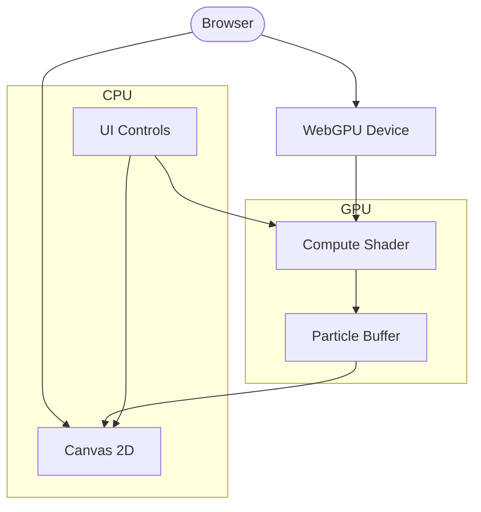
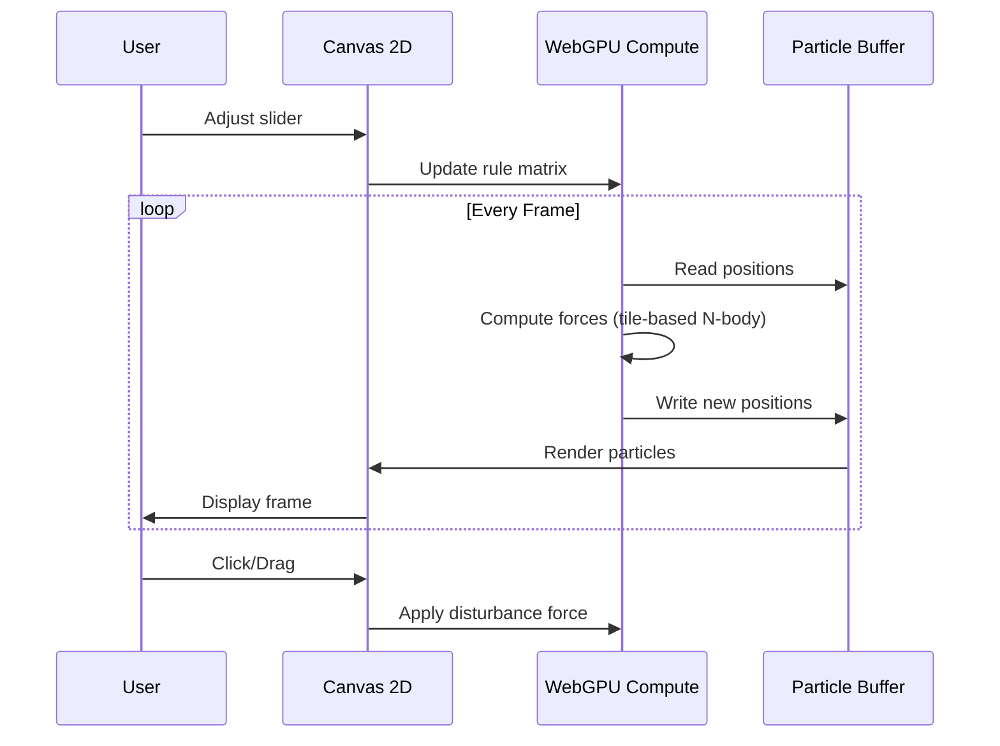

# glitch — WebGPU Particle Life Simulator

**Emergent patterns from simple rules. 100k particles simulated on your GPU.**

A browser-based particle life simulation powered by WebGPU compute shaders. Each particle follows simple attraction and repulsion rules based on its type, creating complex emergent patterns — think artificial life, cellular automata, and flocking behavior combined.

---

## Fully Vibecoded with Hermes Agent

This project was built entirely through natural language conversations with [Hermes Agent](https://hermes-agent.nousresearch.com) — an autonomous AI coding assistant. From architecture to deployment, every line of code was generated, tested, and shipped via chat prompts.

---

## Features

- **Particle Life Algorithm** — Each particle type attracts or repels others, creating emergent organic patterns
- **100k+ Particles** — GPU compute shaders handle the simulation, not the CPU
- **6 Particle Types** — Full 6x6 rule matrix with 36 interactive sliders
- **Real-time Controls** — Pause, play, reset, adjust particle count (10k–200k)
- **Dark Cyberpunk Theme** — Cyan glow, neon accents, CRT scanlines
- **Fullscreen Responsive** — Adapts to any screen size with DPR-aware rendering
- **Mouse Interaction** — Click and drag to disturb particles, watch ripple effects

---

## Architecture



### Data Flow



---

## Tech Stack

| Layer | Technology | Purpose |
|-------|-----------|---------|
| Language | Vanilla JS (ES2020) + WGSL | No framework overhead |
| Bundler | Vite 8 | Fast dev server + optimized builds |
| GPU API | WebGPU Compute Shaders | Tile-based N-body with shared memory |
| Rendering | Canvas 2D | Particle rendering with motion trails |
| Design | Cyberpunk/Glitch | Dark theme, cyan glow, CRT scanlines |
| Hosting | Vercel (Static) | Global CDN, instant deploy |

---

## Live Demo

| Link | Description |
|------|-------------|
| [glitch-particle-life.vercel.app](https://glitch-particle-life.vercel.app) | Die Simulation — WebGPU Particle Life |
| [glitch-site-web.vercel.app](https://glitch-site-web.vercel.app) | Landing Page mit Features und Docs |

---

## Getting Started

### Prerequisites

- Node.js >= 18
- A browser with WebGPU support (Chrome 113+, Edge 113+, Opera 99+)

### 1. Clone & Install

```bash
git clone https://github.com/kvnlnk/glitch.git
cd glitch
npm install
```

### 2. Run Locally

```bash
npm run dev
```

Open `http://localhost:5173` in a WebGPU-compatible browser.

### 3. Build for Production

```bash
npm run build
npm run preview
```

---

## Project Structure

```
glitch/
├── index.html              # Single-page entry point
├── package.json            # Vite dependency
├── vite.config.js          # Build config
├── src/
│   ├── main.js             # Canvas rendering, animation loop, UI controls
│   ├── webgpu.js           # WebGPU device init, buffers, bind groups, dispatch
│   ├── shader.wgsl         # WGSL compute shader (particle physics)
│   └── styles.css          # Dark cyberpunk theme, control panel layout
├── site/                   # Landing page (separately deployed)
│   ├── index.html
│   ├── src/
│   └── vercel.json
├── .vercel/                # Vercel project config
└── README.md
```

---

## Controls

| Control | Description |
|---------|-------------|
| Particle count slider | Adjust 10,000 to 200,000 particles |
| Rule matrix (36 sliders) | Tune attraction (-1) to repulsion (+1) for each of the 6 type pairs |
| Pause/Play | Freeze the simulation mid-animation |
| Reset | Randomize all particle positions |
| Click & Drag | Apply disturbance force to particles under cursor |
| FPS counter | Monitor real-time performance |

---

## How It Works

1. **WebGPU Compute Shader** updates all particle positions on the GPU using a tile-based N-body algorithm with shared memory for performance
2. **Canvas 2D** renders each particle as a small colored circle; a semi-transparent overlay each frame creates natural motion trails
3. **Rule Matrix** defines attraction/repulsion values between each pair of the 6 particle types — this is the "genome" that determines the emergent behavior
4. **Toroidal World** — particles wrap around screen edges for a seamless infinite simulation space
5. **Mouse Interaction** — clicking or dragging injects a radial disturbance force, creating ripple effects through the particle swarm

---

## Deployment

```bash
# Deploy to Vercel
vercel --prod
```

Both the simulation and the landing page (`site/`) are deployed independently on Vercel.

---

## License

MIT

---

<p align="center">Made with by <a href="https://github.com/kvnlnk">kvnlnk</a> &mdash; <a href="https://kevinlingk.com">kevinlingk.com</a></p>
